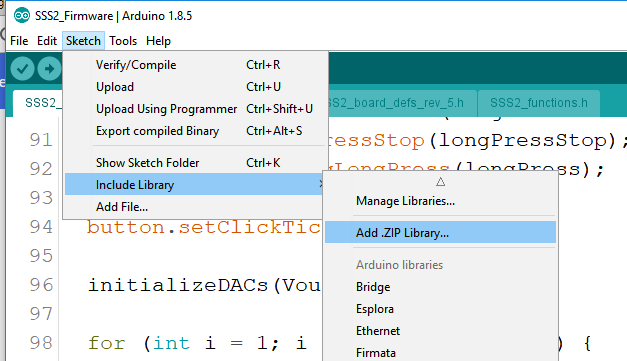
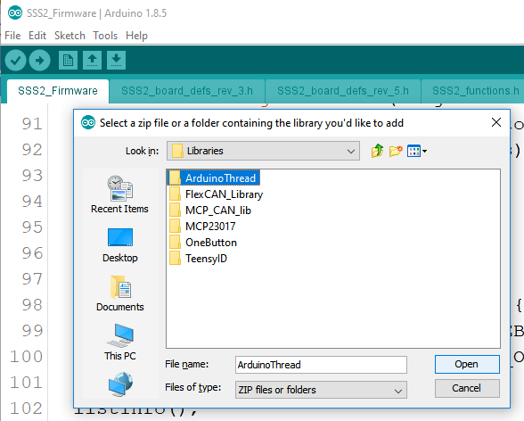
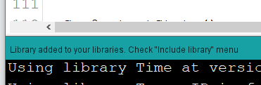

## Smart Sensor Simulator 2 Libraries

These are the necessary libraries for your install for the SSS2.

The latest software version uses Arduino 1.8.5 and Teensyduino 1.41. You can select all the additional libraries, except for FlexCAN, you'll install that later. If you forget to uncheck FlexCAN, no big deal; we'll delete it later. 

Before starting be sure to delete the following libraries from your personal libraries folder:

  * ArduinoThread
  * FlexCAN_Library
  * MCP_CAN_lib
  * MCP23017
  * OneButton
  * TeensyID

Also, Teensyduino installs a different version of the FlexCAN library at `C:\Program Files (x86)\Arduino\hardware\teensy\avr\libraries` on Windows. This folder needs to be deleted if it is present. 

To install the recommended SSS2 libraries, use the Arduino IDE. In Arduino, select Sketch -> Include Library -> Add .Zip Library...

Select the Library folder and press Open. 

Success will show a message in the Arduino IDE.

Repeat this process for each library in the SSS2/Libraries folder

