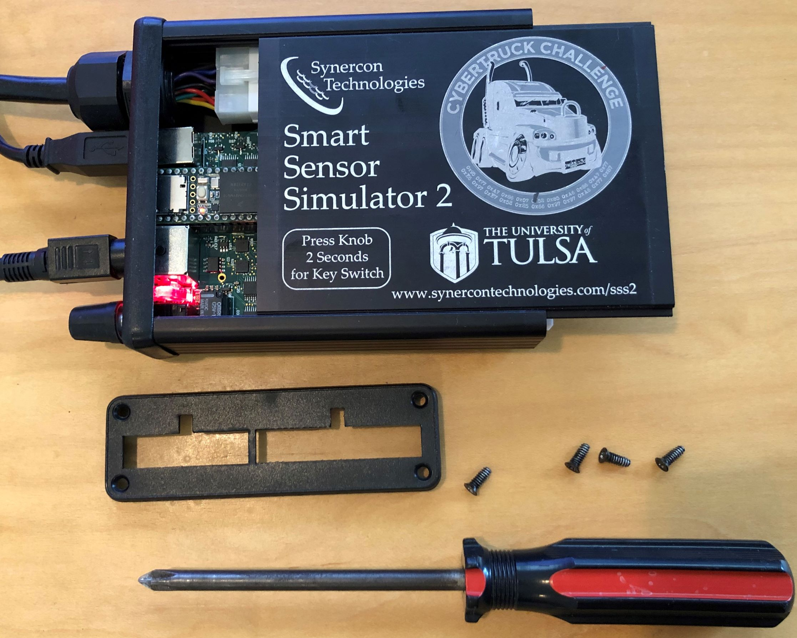
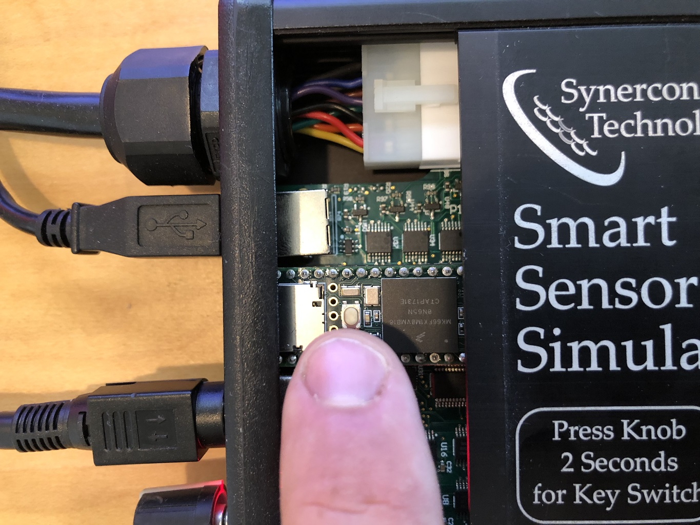

# Reflashing the SSS2
The firmware on the Smart Sensor Simulator 2 can be upgraded using the Arduino and Teensyduino enviroment. This repository contains the firmware binaries (`.hex`) files.

To update the firmware, you will need the Teensyduino loader available from the PJRC website:

https://www.pjrc.com/teensy/loader_win10.html

Once the teensy loader is installed, you can upload the binary (.hex) files to the device.

## Procedure
 1. Download the desired firmware from this repository, save it in a known location (i.e. your Downloads folder.)
 2. Open the `teensy.exe` application. You can find the application by searching for it in the Windows start menu.
 3. Under the file menu, select `Open HEX File`. Select the firmware image you saved to your computer.
 4. Open the SSS2 enclosure:
 	a. Unscrew the four screws on the bezel covering the end with the white Molex connectors.
 	b. Remove the bezel.
 	c. Slide the labeled panel to expose the Teensy 3.6 Development board that has a small white press button.
 5. Connect the USB Cable to the SSS2 and your computer.
 6. Connect +12V power to the SSS2.
 7. Press the white "Program Mode" button on the Teensy 3.6 board in the SSS2. 
 8. Confirm the update took place: the Teensy application should bring up a progress bar that says programming.
 9. Unplug the SSS2.
 10. Reconnect the bezel and tighten the screws.

